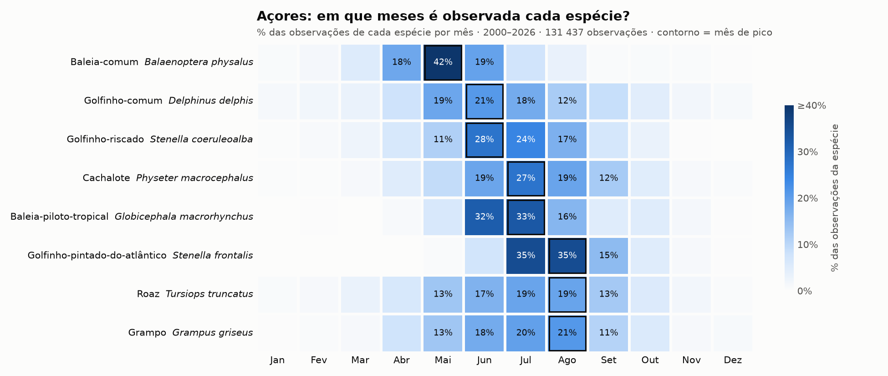
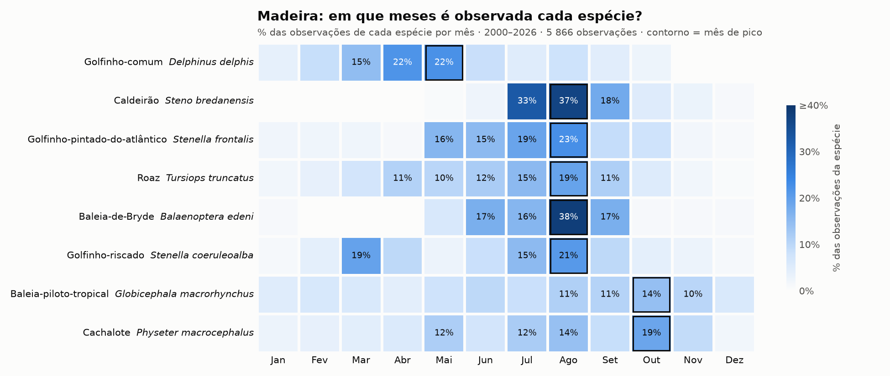
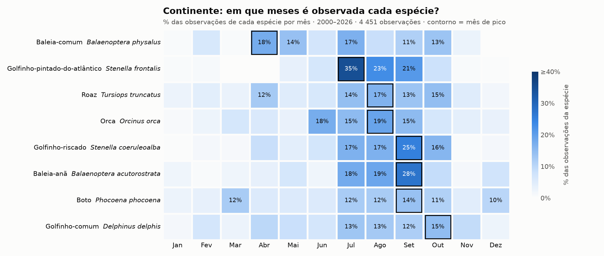

# Sazonalidade dos cetáceos em Portugal

Análise de cerca de 140 mil observações de baleias e golfinhos em Portugal (2000–2026), com dados
abertos do GBIF, para responder a uma pergunta simples: **que espécies aparecem em que meses, e
isso muda entre os Açores, a Madeira e o Continente?**

**🌊 Site interativo: [dinistcosta.github.io/cetaceos](https://dinistcosta.github.io/cetaceos/)**:
calendário das espécies com escolha de região e de anos, e mapa sazonal mês a mês.

## Principais resultados

- **Açores:** a maioria das espécies tem o pico de observações entre junho e agosto. A exceção é
  a **baleia-comum**, com o pico em maio (42% das observações), o que é consistente com a passagem
  pelo arquipélago durante a migração de primavera. O **golfinho-pintado-do-atlântico** é a espécie
  mais sazonal: 70% das observações são de julho e agosto.
- **Madeira:** a **baleia-piloto-tropical** é observada ao longo de todo o ano, o que sugere a
  presença de uma população residente. A baleia-de-Bryde e o caldeirão concentram-se no final do
  verão, e o golfinho-comum tem o pico na primavera (março a maio).
- **Continente:** os padrões são menos marcados e várias espécies continuam a ser observadas até
  setembro e outubro.

### Açores (n = 131 437)


### Madeira (n = 5 866)


### Continente (n = 4 451)


Cada linha mostra a percentagem das observações dessa espécie que ocorreu em cada mês (cada linha
soma 100%). Assim é possível comparar espécies com números de observações muito diferentes.

A versão interativa destes gráficos, com um mapa mês a mês, está no
[site do projeto](https://dinistcosta.github.io/cetaceos/). O código do site está em [`docs/`](docs/).
O mapa feito com folium no notebook está em [`mapa_sazonal.html`](mapa_sazonal.html)
(descarregar e abrir no browser).

## Dados

- **Fonte:** download de ocorrências do [GBIF](https://www.gbif.org) com os filtros: Cetacea,
  país = Portugal, com coordenadas, sem problemas geoespaciais.
- **Citação:** GBIF.org (7 October 2026) GBIF Occurrence Download https://doi.org/10.15468/dl.mzf9rc
- O ficheiro original (`DADOS GBIF.csv`, cerca de 100 MB) não está incluído no repositório. Pode
  ser descarregado através do DOI acima.

## Métodos

1. Leitura do ficheiro do GBIF (separado por tabulações) com **pandas**.
2. Remoção das observações sem espécie identificada ou sem mês (de 188 687 para cerca de 146 760).
3. Atribuição de uma região a partir das coordenadas: longitude < −24° → Açores; latitude < 34° →
   Madeira; restantes → Continente.
4. Seleção do período de estudo: **2000 até 2026** (141 754 observações), com base no número de
   registos por ano.
5. Para cada região, tabela espécie × mês das 8 espécies mais observadas, convertida em
   percentagem por espécie e representada como heatmap com **seaborn**.
6. Mapa de densidade animado por mês com **folium** (`HeatMapWithTime`). Para o mapa ficar mais
   leve, as coordenadas foram arredondadas a cerca de 1 km.

## Limitações

- **Os dados não medem abundância.** Registam onde e quando houve observadores. No verão há mais
  barcos de observação de baleias, por isso parte do pico de verão reflete o esforço de observação
  e não só a presença dos animais.
- **Dados muito desiguais entre regiões.** 93% das observações são dos Açores. Os resultados da
  Madeira e do Continente baseiam-se em muito menos registos.
- **Poucos registos recentes.** 2020 tem muito menos dados (pandemia) e de 2021 em diante há
  poucos registos, provavelmente porque ainda não foram publicados no GBIF.
- A divisão por regiões usa limites simples de coordenadas e não fronteiras oficiais.

## Como reproduzir

```bash
python -m venv venv
source venv/bin/activate
pip install -r requirements.txt
```

1. Descarregar os dados pelo DOI acima e guardar como `DADOS GBIF.csv` na pasta do projeto.
2. Abrir `analise.ipynb` e correr todas as células.

## Ferramentas

Python · pandas · matplotlib · seaborn · folium · Jupyter
